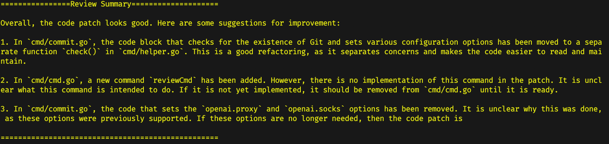
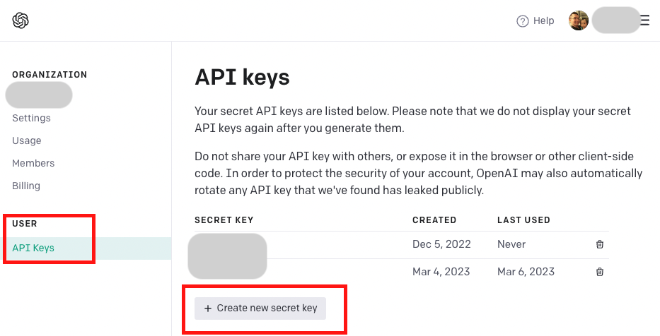
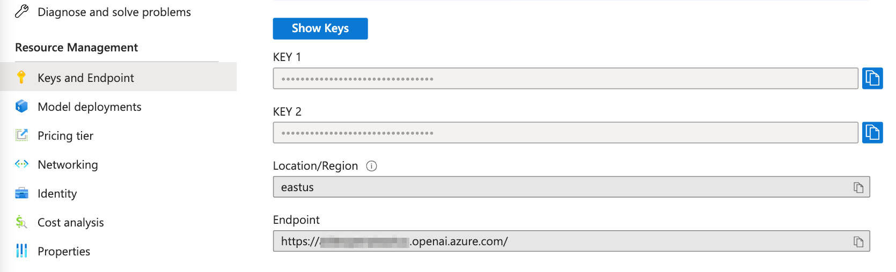
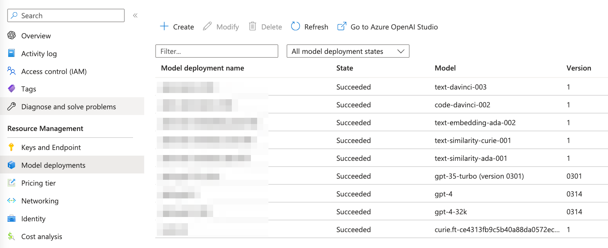

# CodeGPT

[](https://github.com/appleboy/CodeGPT/actions/workflows/testing.yml)
[](https://codecov.io/gh/appleboy/CodeGPT)
[](https://goreportcard.com/report/github.com/appleboy/CodeGPT)


English | [繁體中文](./README.zh-tw.md)

A CLI written in [Go](https://go.dev) that writes git commit messages or provides a code review summary for you using ChatGPT AI (gpt-3.5-turbo, gpt-4 model) and automatically installs a [git prepare-commit-msg hook](https://git-scm.com/docs/githooks).

- [繁體中文介紹][1]
- [繁體中文影片][2]

[1]: https://blog.wu-boy.com/2023/03/writes-git-commit-messages-using-chatgpt/
[2]: https://www.youtube.com/watch?v=4Yei_t6eMZU


## Features

- Supports [Azure OpenAI Service](https://azure.microsoft.com/en-us/products/cognitive-services/openai-service), [OpenAI API](https://platform.openai.com/docs/api-reference), [Gemini][60], [Anthropic][100], [Ollama][41], [Groq][30], and [OpenRouter][50].
- Supports [conventional commits specification](https://www.conventionalcommits.org/en/v1.0.0/).
- Supports Git prepare-commit-msg Hook, see the [Git Hooks documentation](https://git-scm.com/book/en/v2/Customizing-Git-Git-Hooks).
- Supports customizing generated diffs with n lines of context, the default is three.
- Supports excluding files from the git diff command.
- Supports commit message translation into another language (supports `en`, `zh-tw`, or `zh-cn`).
- Supports socks proxy or custom network HTTP proxy.
- Supports [model lists](https://github.com/appleboy/CodeGPT/blob/bf28f000463cfc6dfa2572df61e1b160c5c680f7/openai/openai.go#L18-L38) like `gpt-4`, `gpt-3.5-turbo`, etc.
- Supports generating a brief code review.



## Installation

Install from [Homebrew](http://brew.sh/) on macOS

```sh
brew tap appleboy/tap
brew install codegpt
```

Install from [Chocolatey](https://chocolatey.org/install) on Windows

```sh
choco install codegpt
```

The pre-compiled binaries can be downloaded from [release page](https://github.com/appleboy/CodeGPT/releases). Change the binary permissions to `755` and copy the binary to the system bin directory. Use the `codegpt` command as shown below.

```sh
$ codegpt version
version: v0.4.3 commit: xxxxxxx
```

Install from source code:

```sh
go install github.com/appleboy/CodeGPT/cmd/codegpt@latest
```

## Setup

Please first create your OpenAI API Key. The [OpenAI Platform](https://platform.openai.com/account/api-keys) allows you to generate a new API Key.



An environment variable is a variable that is set on your operating system, rather than within your application. It consists of a name and value. We recommend that you set the name of the variable to `OPENAI_API_KEY`.

See the [Best Practices for API Key Safety](https://help.openai.com/en/articles/5112595-best-practices-for-api-key-safety).

```sh
export OPENAI_API_KEY=sk-xxxxxxx
```

or store your API key in a custom config file.

```sh
codegpt config set openai.api_key sk-xxxxxxx
```

This will create a `.codegpt.yaml` file in your home directory ($HOME/.config/codegpt/.codegpt.yaml). The following options are available.

| Option                       | Description                                                                                                                                                                    |
| ---------------------------- | ------------------------------------------------------------------------------------------------------------------------------------------------------------------------------ |
| **openai.base_url**          | Replace the default base URL (`https://api.openai.com/v1`).                                                                                                                    |
| **openai.api_key**           | Generate API key from [openai platform page](https://platform.openai.com/account/api-keys).                                                                                    |
| **openai.org_id**            | Identifier for this organization sometimes used in API requests. See [organization settings](https://platform.openai.com/account/org-settings). Only for `openai` service.     |
| **openai.model**             | Default model is `gpt-3.5-turbo`, you can change to `gpt-4-turbo` or other custom model (Groq or OpenRouter provider).                                                         |
| **openai.proxy**             | HTTP/HTTPS client proxy.                                                                                                                                                       |
| **openai.socks**             | SOCKS client proxy.                                                                                                                                                            |
| **openai.timeout**           | Default HTTP timeout is `10s` (ten seconds).                                                                                                                                   |
| **openai.max_tokens**        | Default max tokens is `300`. See reference [max_tokens](https://platform.openai.com/docs/api-reference/completions/create#completions/create-max_tokens).                      |
| **openai.temperature**       | Default temperature is `1`. See reference [temperature](https://platform.openai.com/docs/api-reference/completions/create#completions/create-temperature).                     |
| **git.diff_unified**         | Generate diffs with `<n>` lines of context, default is `3`.                                                                                                                    |
| **git.exclude_list**         | Exclude file from `git diff` command.                                                                                                                                          |
| **openai.provider**          | Default service provider is `openai`, you can change to `azure`.                                                                                                               |
| **output.lang**              | Default language is `en` and available languages `zh-tw`, `zh-cn`, `ja`.                                                                                                       |
| **openai.top_p**             | Default top_p is `1.0`. See reference [top_p](https://platform.openai.com/docs/api-reference/completions/create#completions/create-top_p).                                     |
| **openai.frequency_penalty** | Default frequency_penalty is `0.0`. See reference [frequency_penalty](https://platform.openai.com/docs/api-reference/completions/create#completions/create-frequency_penalty). |
| **openai.presence_penalty**  | Default presence_penalty is `0.0`. See reference [presence_penalty](https://platform.openai.com/docs/api-reference/completions/create#completions/create-presence_penalty).    |

### How to change to Azure OpenAI Service

Please get the `API key`, `Endpoint` and `Model deployments` list from Azure Resource Management Portal on left menu.





Update your config file.

```sh
codegpt config set openai.provider azure
codegpt config set openai.base_url https://xxxxxxxxx.openai.azure.com/
codegpt config set openai.api_key xxxxxxxxxxxxxxxx
codegpt config set openai.model xxxxx-gpt-35-turbo
```

### Support [Gemini][60] API Service

Build with the Gemini API, you can see the [Gemini API documentation][61]. Update the `provider` and `api_key` in your config file. Please create an API key from the [Gemini API][62] page.

```sh
codegpt config set openai.provider gemini
codegpt config set openai.api_key xxxxxxx
codegpt config set openai.model gemini-1.5-flash-latest
```

[60]: https://ai.google.dev/gemini-api
[61]: https://ai.google.dev/gemini-api/docs
[62]: https://aistudio.google.com/app/apikey

### Support [Anthropic][100] API Service

Build with the Anthropic API, you can see the [Anthropic API documentation][101]. Update the `provider` and `api_key` in your config file. Please create an API key from the [Anthropic API][102] page.

```sh
codegpt config set openai.provider anthropic
codegpt config set openai.api_key xxxxxxx
codegpt config set openai.model claude-3-5-sonnet-20241022
```

See the model list from the [Anthropic API documentation][103].

[100]: https://anthropic.com/
[101]: https://docs.anthropic.com/en/home
[102]: https://anthropic.com/
[103]: https://docs.anthropic.com/en/docs/about-claude/models

### How to change to [Groq][30] API Service

Please get the `API key` from Groq API Service, please visit [here][31]. Update the `base_url` and `api_key` in your config file.

```sh
codegpt config set openai.provider openai
codegpt config set openai.base_url https://api.groq.com/openai/v1
codegpt config set openai.api_key gsk_xxxxxxxxxxxxxx
codegpt config set openai.model llama3-8b-8192
```

GroqCloud currently supports the [following models][32]:

1. [Production Models](https://console.groq.com/docs/models#production-models)
2. [Preview Models](https://console.groq.com/docs/models#preview-models)

[30]: https://groq.com/
[31]: https://console.groq.com/keys
[32]: https://console.groq.com/docs/models

### How to change to ollama API Service

We can use the Llama3 model from the [ollama][41] API Service, please visit [here][40]. Update the `base_url` in your config file.

[40]: https://github.com/ollama/ollama/blob/main/docs/openai.md#models
[41]: https://github.com/ollama/ollama

```sh
# pull llama3 8b model
ollama pull llama3
ollama cp llama3 gpt-3.5-turbo
```

Try to use the `ollama` API Service.

```sh
curl http://localhost:11434/v1/chat/completions \
  -H "Content-Type: application/json" \
  -d '{
    "model": "gpt-3.5-turbo",
    "messages": [
      {
        "role": "user",
        "content": "Hello!"
      }
    ]
  }'
```

Update the `base_url` in your config file. You don't need to set the `api_key` in the config file.

```sh
codegpt config set openai.base_url http://localhost:11434/v1
```

### How to change to [OpenRouter][50] API Service

You can see the [supported models list][51], model usage can be paid by users, developers, or both, and may shift in [availability][52]. You can also fetch models, prices, and limits [via API][53].

The following example use free model name: `meta-llama/llama-3-8b-instruct:free`

```sh
codegpt config set openai.provider openai
codegpt config set openai.base_url https://openrouter.ai/api/v1
codegpt config set openai.api_key sk-or-v1-xxxxxxxxxxxxxxxx
codegpt config set openai.model google/learnlm-1.5-pro-experimental:free
```

[50]: https://openrouter.ai/
[51]: https://openrouter.ai/docs#models
[52]: https://openrouter.ai/terms#services
[53]: https://openrouter.ai/api/v1/models

For including your app on openrouter.ai rankings and Shows in rankings on openrouter.ai, you can set the `openai.headers` in your config file.

```sh
codegpt config set openai.headers "HTTP-Referer=https://github.com/appleboy/CodeGPT X-Title=CodeGPT"
```

- **HTTP-Refer**: Optional, for including your app on openrouter.ai rankings.
- **X-Title**: Optional, for Shows in rankings on openrouter.ai.

## Usage

There are two methods for generating a commit message using the `codegpt` command: CLI mode and Git Hook.

### CLI Mode

You can call `codegpt` directly to generate a commit message for your staged changes:

```sh
git add <files...>
codegpt commit --preview
```

The commit message is shown below.

```sh
Summarize the commit message use gpt-3.5-turbo model
We are trying to summarize a git diff
We are trying to summarize a title for pull request
================Commit Summary====================

feat: Add preview flag and remove disableCommit flag in commit command and template file.

- Add a `preview` flag to the `commit` command
- Remove the `disbaleCommit` flag from the `prepare-commit-msg` template file

==================================================
Write the commit message to .git/COMMIT_EDITMSG file
```

or translate all git commit messages into a different language (`Traditional Chinese`, `Simplified Chinese` or `Japanese`)

```sh
codegpt commit --lang zh-tw --preview
```

Consider the following outcome:

```sh
Summarize the commit message use gpt-3.5-turbo model
We are trying to summarize a git diff
We are trying to summarize a title for pull request
We are trying to translate a git commit message to Traditional Chinese language
================Commit Summary====================

功能：重構 codegpt commit 命令標記

- 將「codegpt commit」命令新增「預覽」標記
- 從「codegpt commit」命令中移除「--disableCommit」標記

==================================================
Write the commit message to .git/COMMIT_EDITMSG file
```

You can replace the tip of the current branch by creating a new commit. just use `--amend` flag

```sh
codegpt commit --amend
```

## Change commit message template

Default commit message template as following:

```tmpl
{{ .summarize_prefix }}: {{ .summarize_title }}

{{ .summarize_message }}
```

change format with template string using `--template_string` parameter:

```sh
codegpt commit --preview --template_string \
  "[{{ .summarize_prefix }}]: {{ .summarize_title }}"
```

change format with template file using `--template_file` parameter:

```sh
codegpt commit --preview --template_file your_file_path
```

Add custom variable to git commit message template:

```sh
{{ .summarize_prefix }}: {{ .summarize_title }}

{{ .summarize_message }}

{{ if .JIRA_URL }}{{ .JIRA_URL }}{{ end }}
```

Add custom variable to git commit message template using `--template_vars` parameter:

```sh
codegpt commit --preview --template_file your_file_path --template_vars \
  JIRA_URL=https://jira.example.com/ABC-123
```

Load custom variable from file using `--template_vars_file` parameter:

```sh
codegpt commit --preview --template_file your_file_path --template_vars_file your_file_path
```

See the `template_vars_file` format as following:

```env
JIRA_URL=https://jira.example.com/ABC-123
```

### Git hook

You can also use the prepare-commit-msg hook to integrate `codegpt` with Git. This allows you to use Git normally and edit the commit message before committing.

#### Install

You want to install the hook in the Git repository:

```sh
codegpt hook install
```

#### Uninstall

You want to remove the hook from the Git repository:

```sh
codegpt hook uninstall
```

Stage your files and commit after installation:

```sh
git add <files...>
git commit
```

`codegpt` will generate the commit message for you and pass it back to Git. Git will open it with the configured editor for you to review/edit it. Then, to commit, save and close the editor!

```sh
$ git commit
Summarize the commit message use gpt-3.5-turbo model
We are trying to summarize a git diff
We are trying to summarize a title for pull request
================Commit Summary====================

Improve user experience and documentation for OpenAI tools

- Add download links for pre-compiled binaries
- Include instructions for setting up OpenAI API key
- Add a CLI mode for generating commit messages
- Provide references for OpenAI Chat completions and ChatGPT/Whisper APIs

==================================================
Write the commit message to .git/COMMIT_EDITMSG file
[main 6a9e879] Improve user experience and documentation for OpenAI tools
 1 file changed, 56 insertions(+)
```

### Code Review

You can use `codegpt` to generate a code review message for your staged changes:

```sh
codegpt review
```

or translate all code review messages into a different language (`Traditional Chinese`, `Simplified Chinese` or `Japanese`)

```sh
codegpt review --lang zh-tw
```

See the following result:

```sh
Code review your changes using gpt-3.5-turbo model
We are trying to review code changes
PromptTokens: 1021, CompletionTokens: 200, TotalTokens: 1221
We are trying to translate core review to Traditional Chinese language
PromptTokens: 287, CompletionTokens: 199, TotalTokens: 486
================Review Summary====================

總體而言，此程式碼修補似乎在增加 Review 指令的功能，允許指定輸出語言並在必要時進行翻譯。以下是需要考慮的潛在問題：

- 輸出語言沒有進行輸入驗證。如果指定了無效的語言代碼，程式可能會崩潰或產生意外結果。
- 此使用的翻譯 API 未指定，因此不清楚是否存在任何安全漏洞。
- 無法處理翻譯 API 調用的錯誤。如果翻譯服

==================================================
```

another php example code:

```php
<?php
if( isset( $_POST[ 'Submit' ]  ) ) {
  // Get input
  $target = $_REQUEST[ 'ip' ];
  // Determine OS and execute the ping command.
  if( stristr( php_uname( 's' ), 'Windows NT' ) ) {
    // Windows
    $cmd = shell_exec( 'ping  ' . $target );
  }
  else {
    // *nix
    $cmd = shell_exec( 'ping  -c 4 ' . $target );
  }
  // Feedback for the end user
  $html .= "<pre>{$cmd}</pre>";
}
?>
```

code review result:

```sh
================Review Summary====================

Code review:

1. Security: The code is vulnerable to command injection attacks as the user input is directly used in the shell_exec() function. An attacker can potentially execute malicious commands on the server by injecting them into the 'ip' parameter.
2. Error handling: There is no error handling in the code. If the ping command fails, the error message is not displayed to the user.
3. Input validation: There is no input validation for the 'ip' parameter. It should be validated to ensure that it is a valid IP address or domain name.
4. Cross-platform issues: The code assumes that the server is either running Windows or *nix operating systems. It may not work correctly on other platforms.

Suggestions for improvement:

1. Use escapeshellarg() function to sanitize the user input before passing it to shell_exec() function to prevent command injection.
2. Implement error handling to display error messages to the user if the ping command fails.
3. Use a regular expression to validate the 'ip' parameter to ensure that it is a valid IP address or domain name.
4. Use a more robust method to determine the operating system, such as the PHP_OS constant, which can detect a wider range of operating systems.

==================================================
```

## Testing

Run the following command to test the code:

```sh
make test
```

## Star History

[](https://star-history.com/#appleboy/codegpt&Date)

## Reference

- [OpenAI Chat completions documentation](https://platform.openai.com/docs/guides/chat).
- [Introducing ChatGPT and Whisper APIs](https://openai.com/blog/introducing-chatgpt-and-whisper-apis)
