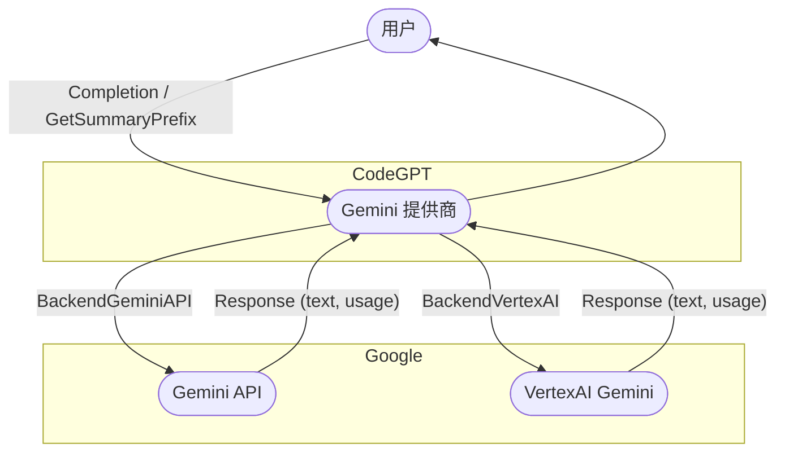

# CodeGPT

[](https://github.com/appleboy/CodeGPT/actions/workflows/testing.yml)
[](https://codecov.io/gh/appleboy/CodeGPT)
[](https://goreportcard.com/report/github.com/appleboy/CodeGPT)


[English](./README.md) | [繁體中文](./README.zh-tw.md) | 简体中文

## 目录

- [CodeGPT](#codegpt)
  - [目录](#目录)
  - [功能](#功能)
  - [安装](#安装)
    - [使用安装脚本](#使用安装脚本)
      - [可配置的环境变量](#可配置的环境变量)
    - [从源码安装](#从源码安装)
    - [使用 VSCode Devcontainer](#使用-vscode-devcontainer)
  - [配置](#配置)
    - [如何自定义默认提示文件夹](#如何自定义默认提示文件夹)
    - [如何切换到 Azure OpenAI 服务](#如何切换到-azure-openai-服务)
    - [支持 Gemini API 服务](#支持-gemini-api-服务)
      - [配置选项](#配置选项)
      - [示例：Gemini API（默认后端）](#示例gemini-api默认后端)
      - [示例：VertexAI Gemini](#示例vertexai-gemini)
    - [支持 Anthropic API 服务](#支持-anthropic-api-服务)
    - [如何切换到 Groq API 服务](#如何切换到-groq-api-服务)
    - [如何切换到 ollama API 服务](#如何切换到-ollama-api-服务)
    - [如何切换到 OpenRouter API 服务](#如何切换到-openrouter-api-服务)
  - [使用](#使用)
    - [CLI 模式](#cli-模式)
  - [更改提交信息模板](#更改提交信息模板)
    - [Git hook](#git-hook)
      - [安装 hook](#安装-hook)
      - [卸载 hook](#卸载-hook)

一个用 [Go](https://go.dev) 编写的 CLI 工具，它使用 ChatGPT AI（gpt-4o，gpt-4 模型）为你编写 git 提交信息或提供代码审查摘要，并自动安装 [git prepare-commit-msg hook](https://git-scm.com/docs/githooks)。

- [繁體中文介紹][1]
- [繁體中文影片][2]

[1]: https://blog.wu-boy.com/2023/03/writes-git-commit-messages-using-chatgpt/
[2]: https://www.youtube.com/watch?v=4Yei_t6eMZU


## 功能

- 支持 [Azure OpenAI Service](https://azure.microsoft.com/en-us/products/cognitive-services/openai-service)、[OpenAI API](https://platform.openai.com/docs/api-reference)、[Gemini][60]、[Anthropic][100]、[Ollama][41]、[Groq][30] 和 [OpenRouter][50]。
- 支持 [conventional commits 规范](https://www.conventionalcommits.org/en/v1.0.0/)。
- 支持 Git prepare-commit-msg Hook，参见 [Git Hooks 文档](https://git-scm.com/book/en/v2/Customizing-Git-Git-Hooks)。
- 支持通过指定上下文行数自定义差异生成（默认值：3）。
- 支持 git diff 排除文件模式。
- 支持将提交信息翻译成其他语言（支持 `en`、`zh-tw` 或 `zh-cn`）。
- 支持 socks 代理或自定义网络 HTTP 代理。
- 支持 [模型列表](https://github.com/appleboy/CodeGPT/blob/bf28f000463cfc6dfa2572df61e1b160c5c680f7/openai/openai.go#L18-L38)，如 `gpt-4`、`gpt-4o` 等。
- 支持生成简要的代码审查。
- 支持自定义提示模板和变量。


## 安装

在 macOS 上通过 [Homebrew](http://brew.sh/) 安装

```sh
brew tap appleboy/tap
brew install codegpt
```

在 Windows 上通过 [Chocolatey](https://chocolatey.org/install) 安装

```sh
choco install codegpt
```

### 使用安装脚本

```sh
# 下载并运行安装脚本
bash < <(curl -sSL https://raw.githubusercontent.com/appleboy/CodeGPT/main/install.sh)
```

或手动下载并运行：

```sh
chmod +x install.sh
./install.sh
```

#### 可配置的环境变量

| 变量名        | 默认值             | 说明                                      |
| ------------- | ------------------ | ----------------------------------------- |
| VERSION       | latest             | 要安装的 CodeGPT 版本（默认为最新发布版） |
| INSTALL_DIR   | $HOME/.codegpt/bin | 安装目录                                  |
| CURL_INSECURE | false              | 是否跳过 SSL 验证 (true/false)            |

使用示例：

```sh
# 安装指定版本到自定义目录
VERSION=0.15.0 INSTALL_DIR=/opt/codegpt ./install.sh
```

该脚本会：

1. 检测您的操作系统和架构
2. 下载最新版二进制文件
3. 将程序加入您的 PATH

可以从 [发布页面](https://github.com/appleboy/CodeGPT/releases) 下载预编译的二进制文件。将二进制文件权限更改为 `755` 并将其复制到系统 bin 目录。使用如下所示的 `codegpt` 命令。

```sh
$ codegpt version
version: v0.4.3 commit: xxxxxxx
```

### 从源码安装

从源码安装：

```sh
go install github.com/appleboy/CodeGPT/cmd/codegpt@latest
```

### 使用 VSCode Devcontainer

在 devcontainer.json 中添加 [feature](https://github.com/kvokka/features/tree/main/src/codegpt)：

```json
"features": {
  "ghcr.io/kvokka/features/codegpt:1": {}
}
```

## 配置

请先创建你的 OpenAI API Key。可以在 [OpenAI 平台](https://platform.openai.com/account/api-keys) 生成新的 API Key。


环境变量是设置在操作系统上的变量，而不是在应用程序内。它由名称和值组成。我们建议将变量名称设置为 `OPENAI_API_KEY`。

参见 [API Key 安全最佳实践](https://help.openai.com/en/articles/5112595-best-practices-for-api-key-safety)。

```sh
export OPENAI_API_KEY=sk-xxxxxxx
```

或者将你的 API key 存储在自定义配置文件中。

```sh
codegpt config set openai.api_key sk-xxxxxxx
```

这将在你的主目录中创建一个 `.codegpt.yaml` 文件（$HOME/.config/codegpt/.codegpt.yaml）。以下选项可用。

| 选项                         | 描述                                                                                                                                                                    |
| ---------------------------- | ----------------------------------------------------------------------------------------------------------------------------------------------------------------------- |
| **openai.base_url**          | 替换默认的基本 URL (`https://api.openai.com/v1`)。                                                                                                                      |
| **openai.api_key**           | 从 [openai 平台页面](https://platform.openai.com/account/api-keys) 生成 API key。                                                                                       |
| **openai.org_id**            | 在 API 请求中有时使用的组织标识符。参见 [组织设置](https://platform.openai.com/account/org-settings)。仅适用于 `openai` 服务。                                          |
| **openai.model**             | 默认模型是 `gpt-4o`，你可以更改为其他自定义模型（Groq 或 OpenRouter 提供）。                                                                                            |
| **openai.proxy**             | HTTP/HTTPS 客户端代理。                                                                                                                                                 |
| **openai.socks**             | SOCKS 客户端代理。                                                                                                                                                      |
| **openai.timeout**           | 默认 HTTP 超时时间是 `10s`（十秒）。                                                                                                                                    |
| **openai.skip_verify**       | 默认 skip_verify 设置为 `false`，可以将其更改为 `true` 以忽略 SSL 验证。                                                                                                |
| **openai.max_tokens**        | 默认最大 token 数是 `300`。参见参考 [max_tokens](https://platform.openai.com/docs/api-reference/completions/create#completions/create-max_tokens)。                     |
| **openai.temperature**       | 默认温度是 `1`。参见参考 [temperature](https://platform.openai.com/docs/api-reference/completions/create#completions/create-temperature)。                              |
| **git.diff_unified**         | 生成具有 `<n>` 行上下文的差异，默认是 `3`。                                                                                                                             |
| **git.exclude_list**         | 从 `git diff` 命令中排除文件。                                                                                                                                          |
| **openai.provider**          | 默认服务提供商是 `openai`，你可以更改为 `azure`。                                                                                                                       |
| **output.lang**              | 默认语言是 `en`，可用语言有 `zh-tw`、`zh-cn`、`ja`。                                                                                                                    |
| **openai.top_p**             | 默认 top_p 是 `1.0`。参见参考 [top_p](https://platform.openai.com/docs/api-reference/completions/create#completions/create-top_p)。                                     |
| **openai.frequency_penalty** | 默认 frequency_penalty 是 `0.0`。参见参考 [frequency_penalty](https://platform.openai.com/docs/api-reference/completions/create#completions/create-frequency_penalty)。 |
| **openai.presence_penalty**  | 默认 presence_penalty 是 `0.0`。参见参考 [presence_penalty](https://platform.openai.com/docs/api-reference/completions/create#completions/create-presence_penalty)。    |
| **prompt.folder**            | 默认提示文件夹是 `$HOME/.config/codegpt/prompt`。                                                                                                                       |

### 如何自定义默认提示文件夹

默认提示文件夹位于 `$HOME/.config/codegpt/prompt`。你可以通过执行以下命令将其更改为其他目录：

```sh
codegpt config set prompt.folder /path/to/your/prompt
```

要从自定义文件夹加载提示文件，请运行：

```sh
codegpt prompt --load
```

执行后，你将看到类似以下的消息：

```sh
save code_review_file_diff.tmpl to /Users/xxxxx/.config/codegpt/prompt/code_review_file_diff.tmpl
save summarize_file_diff.tmpl to /Users/xxxxx/.config/codegpt/prompt/summarize_file_diff.tmpl
save summarize_title.tmpl to /Users/xxxxx/.config/codegpt/prompt/summarize_title.tmpl
save conventional_commit.tmpl to /Users/xxxxx/.config/codegpt/prompt/conventional_commit.tmpl
```

- [code_review_file_diff.tmpl](./prompt/templates/code_review_file_diff.tmpl)
- [summarize_file_diff.tmpl](./prompt/templates/summarize_file_diff.tmpl)
- [summarize_title.tmpl](./prompt/templates/summarize_title.tmpl)
- [conventional_commit.tmpl](./prompt/templates/conventional_commit.tmpl)

### 如何切换到 Azure OpenAI 服务

请从 Azure 资源管理门户左侧菜单获取 `API key`、`Endpoint` 和 `Model deployments` 列表。


更新你的配置文件。

```sh
codegpt config set openai.provider azure
codegpt config set openai.base_url https://xxxxxxxxx.openai.azure.com/
codegpt config set openai.api_key xxxxxxxxxxxxxxxx
codegpt config set openai.model xxxxx-gpt-4o
```

### 支持 [Gemini][60] API 服务

你可以使用 Gemini API 或 VertexAI Gemini 服务。参见 [Gemini API 文档][61] 和 [VertexAI 文档][63]。  
请在配置文件中更新以下参数。

- 请从 [Gemini API][62] 页面（用于 BackendGeminiAPI）或 [VertexAI API Key][64]（用于 BackendVertexAI）创建 API key。

#### 配置选项

| 选项                | 描述                                                                                       | 示例值             | 是否必填 | 默认值             |
| ------------------- | ------------------------------------------------------------------------------------------ | ------------------ | -------- | ------------------ |
| **openai.provider** | 设置为 `gemini` 以使用 Gemini 提供商                                                       | `gemini`           | 是       |                    |
| **gemini.api_key**  | Gemini 或 VertexAI 的 API key                                                              | `xxxxxxx`          | 是       |                    |
| **gemini.model**    | 模型名称（参见 [Gemini 模型][61]）                                                         | `gemini-2.0-flash` | 是       |                    |
| **gemini.backend**  | Gemini 后端：`BackendGeminiAPI`（默认，适用于 Gemini API）或 `BackendVertexAI`（VertexAI） | `BackendGeminiAPI` | 否       | `BackendGeminiAPI` |
| **gemini.project**  | VertexAI 项目 ID（如使用 `BackendVertexAI` 必填）                                          | `my-gcp-project`   | 条件必填 |                    |
| **gemini.location** | VertexAI 区域（如使用 `BackendVertexAI` 必填）                                             | `us-central1`      | 条件必填 |                    |

#### 示例：Gemini API（默认后端）

```sh
codegpt config set openai.provider gemini
codegpt config set gemini.api_key xxxxxxx
codegpt config set openai.model gemini-2.0-flash
# gemini.backend 默认为 BackendGeminiAPI，可省略
```

#### 示例：VertexAI Gemini

```sh
codegpt config set openai.provider gemini
codegpt config set openai.model gemini-1.5-pro-preview-0409
codegpt config set gemini.backend BackendVertexAI
codegpt config set gemini.project my-gcp-project
codegpt config set gemini.location us-central1
```

[60]: https://ai.google.dev/gemini-api
[61]: https://ai.google.dev/gemini-api/docs
[62]: https://aistudio.google.com/app/apikey
[63]: https://cloud.google.com/vertex-ai/docs/generative-ai/learn/overview
[64]: https://console.cloud.google.com/apis/credentials



### 支持 [Anthropic][100] API 服务

使用 Anthropic API 构建，你可以参见 [Anthropic API 文档][101]。在你的配置文件中更新 `provider` 和 `api_key`。请从 [Anthropic API][102] 页面创建 API key。

```sh
codegpt config set openai.provider anthropic
codegpt config set openai.api_key xxxxxxx
codegpt config set openai.model claude-3-5-sonnet-20241022
```

参见 [Anthropic API 文档][103] 中的模型列表。

[100]: https://anthropic.com/
[101]: https://docs.anthropic.com/en/home
[102]: https://anthropic.com/
[103]: https://docs.anthropic.com/en/docs/about-claude/models

### 如何切换到 [Groq][30] API 服务

请从 Groq API 服务获取 `API key`，请访问 [这里][31]。在你的配置文件中更新 `base_url` 和 `api_key`。

```sh
codegpt config set openai.provider openai
codegpt config set openai.base_url https://api.groq.com/openai/v1
codegpt config set openai.api_key gsk_xxxxxxxxxxxxxx
codegpt config set openai.model llama3-8b-8192
```

GroqCloud 目前支持 [以下模型][32]：

1. [生产模型](https://console.groq.com/docs/models#production-models)
2. [预览模型](https://console.groq.com/docs/models#preview-models)

[30]: https://groq.com/
[31]: https://console.groq.com/keys
[32]: https://console.groq.com/docs/models

### 如何切换到 ollama API 服务

我们可以使用 [ollama][41] API 服务中的 Llama3 模型，请访问 [这里][40]。在你的配置文件中更新 `base_url`。

[40]: https://github.com/ollama/ollama/blob/main/docs/openai.md#models
[41]: https://github.com/ollama/ollama

```sh
# 拉取 llama3 8b 模型
ollama pull llama3
ollama cp llama3 gpt-4o
```

尝试使用 `ollama` API 服务。

```sh
curl http://localhost:11434/v1/chat/completions \
  -H "Content-Type: application/json" \
  -d '{
    "model": "gpt-4o",
    "messages": [
      {
        "role": "user",
        "content": "Hello!"
      }
    ]
  }'
```

在你的配置文件中更新 `base_url`。你不需要在配置文件中设置 `api_key`。

```sh
codegpt config set openai.base_url http://localhost:11434/v1
```

### 如何切换到 [OpenRouter][50] API 服务

你可以参见 [支持的模型列表][51]，模型使用可以由用户、开发者或两者支付，并且可能会在 [可用性][52] 上有所变化。你还可以通过 [API][53] 获取模型、价格和限制。

以下示例使用免费模型名称：`meta-llama/llama-3-8b-instruct:free`

```sh
codegpt config set openai.provider openai
codegpt config set openai.base_url https://openrouter.ai/api/v1
codegpt config set openai.api_key sk-or-v1-xxxxxxxxxxxxxxxx
codegpt config set openai.model google/learnlm-1.5-pro-experimental:free
```

[50]: https://openrouter.ai/
[51]: https://openrouter.ai/docs#models
[52]: https://openrouter.ai/terms#services
[53]: https://openrouter.ai/api/v1/models

要将你的应用程序包含在 openrouter.ai 排名中并在 openrouter.ai 排名中显示，你可以在配置文件中设置 `openai.headers`。

```sh
codegpt config set openai.headers "HTTP-Referer=https://github.com/appleboy/CodeGPT X-Title=CodeGPT"
```

- **HTTP-Refer**：可选，用于将你的应用程序包含在 openrouter.ai 排名中。
- **X-Title**：可选，用于在 openrouter.ai 排名中显示。

## 使用

有两种方法可以使用 `codegpt` 命令生成提交信息：CLI 模式和 Git Hook。

### CLI 模式

你可以直接调用 `codegpt` 为你的暂存更改生成提交信息：

```sh
git add <files...>
codegpt commit --preview
```

提交信息如下所示。

```sh
使用 gpt-4o 模型总结提交信息
我们正在尝试总结 git diff
我们正在尝试总结拉取请求的标题
================提交摘要====================

feat: 在 commit 命令和模板文件中添加预览标志并移除 disableCommit 标志。

- 在 `commit` 命令中添加 `preview` 标志
- 从 `prepare-commit-msg` 模板文件中移除 `disbaleCommit` 标志

==================================================
将提交信息写入 .git/COMMIT_EDITMSG 文件
```

或将所有 git 提交信息翻译成其他语言（`繁体中文`、`简体中文`或 `日语`）

```sh
codegpt commit --lang zh-tw --preview
```

考虑以下结果：

```sh
使用 gpt-4o 模型总结提交信息
我们正在尝试总结 git diff
我们正在尝试总结拉取请求的标题
我们正在尝试将 git 提交信息翻译成繁体中文
================提交摘要====================

功能：重构 codegpt commit 命令标记

- 将「codegpt commit」命令新增「预览」标记
- 从「codegpt commit」命令中移除「--disableCommit」标记

==================================================
将提交信息写入 .git/COMMIT_EDITMSG 文件
```

你可以使用 `--amend` 标志创建一个新的提交来替换当前分支的尖端。

```sh
codegpt commit --amend
```

## 更改提交信息模板

默认提交信息模板如下：

```tmpl
{{ .summarize_prefix }}: {{ .summarize_title }}

{{ .summarize_message }}
```

使用 `--template_string` 参数更改模板格式：

```sh
codegpt commit --preview --template_string \
  "[{{ .summarize_prefix }}]: {{ .summarize_title }}"
```

使用 `--template_file` 参数更改模板文件格式：

```sh
codegpt commit --preview --template_file your_file_path
```

向 git 提交信息模板添加自定义变量：

```sh
{{ .summarize_prefix }}: {{ .summarize_title }}

{{ .summarize_message }}

{{ if .JIRA_URL }}{{ .JIRA_URL }}{{ end }}
```

使用 `--template_vars` 参数向 git 提交信息模板添加自定义变量：

```sh
codegpt commit --preview --template_file your_file_path --template_vars \
  JIRA_URL=https://jira.example.com/ABC-123
```

使用 `--template_vars_file` 参数从文件加载自定义变量：

```sh
codegpt commit --preview --template_file your_file_path --template_vars_file your_file_path
```

参见 `template_vars_file` 格式如下：

```env
JIRA_URL=https://jira.example.com/ABC-123
```

### Git hook

你还可以使用 prepare-commit-msg hook 将 `codegpt` 与 Git 集成。这允许你正常使用 Git 并在提交前编辑提交信息。

#### 安装 hook

你想在 Git 仓库中安装 hook：

```sh
codegpt hook install
```

#### 卸载 hook

你想从 Git 仓库中移除 hook：

```sh
codegpt hook uninstall
```

安装后暂存你的文件并提交：

```sh
git add <files...>
git commit
```

`codegpt` 将为你生成提交信息并将其传回 Git。Git 将使用配置的编辑器打开它供你审查/编辑。然后，要提交，请保存并关闭编辑器！

```sh
$ git commit
使用 gpt-4o 模型总结提交信息
我们正在尝试总结 git diff
我们正在尝试总结拉取请求的标题
================提交摘要====================

改进 OpenAI 工具的用户体验和文档

- 添加预编译二进制文件的下载链接
- 包括
```
