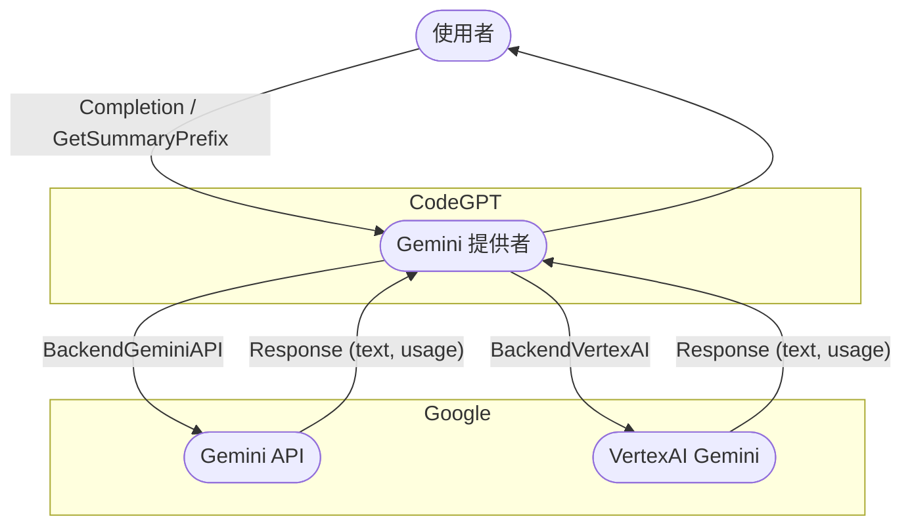

# CodeGPT

[](https://github.com/appleboy/CodeGPT/actions/workflows/testing.yml)
[](https://github.com/appleboy/CodeGPT/actions/workflows/security.yml)
[](https://codecov.io/gh/appleboy/CodeGPT)
[](https://goreportcard.com/report/github.com/appleboy/CodeGPT)

一個用 [Go](https://go.dev) 編寫的 CLI 工具，使用 ChatGPT AI (gpt-4o, gpt-4 模型) 生成 git 提交訊息或提供代碼審查摘要。它還會自動安裝 [git prepare-commit-msg hook](https://git-scm.com/docs/githooks)。

- [繁體中文介紹][1]
- [繁體中文影片][2]

[English](./README.md) | **繁體中文** | [简体中文](./README.zh-cn.md)


## 目錄

- [CodeGPT](#codegpt)
  - [目錄](#目錄)
  - [功能](#功能)
  - [安裝](#安裝)
    - [macOS](#macos)
    - [Windows](#windows)
    - [腳本與二進位安裝](#腳本與二進位安裝)
      - [**A. 自動安裝（推薦）**](#a-自動安裝推薦)
      - [**B. 手動安裝（進階）**](#b-手動安裝進階)
      - [可設定的環境變數](#可設定的環境變數)
    - [從源碼安裝](#從源碼安裝)
    - [VSCode Devcontainer](#vscode-devcontainer)
  - [配置](#配置)
    - [使用 API Key Helper 動態獲取憑證](#使用-api-key-helper-動態獲取憑證)
      - [設置 API Key Helper](#設置-api-key-helper)
      - [配置刷新間隔](#配置刷新間隔)
      - [Gemini 專用 API Key Helper](#gemini-專用-api-key-helper)
      - [工作原理](#工作原理)
      - [優先順序](#優先順序)
    - [如何自定義默認提示文件夾](#如何自定義默認提示文件夾)
    - [如何切換到 Azure OpenAI 服務](#如何切換到-azure-openai-服務)
    - [支援 Gemini API 服務](#支援-gemini-api-服務)
      - [設定選項](#設定選項)
      - [範例：Gemini API（預設後端）](#範例gemini-api預設後端)
      - [範例：VertexAI Gemini](#範例vertexai-gemini)
    - [支援 Anthropic API 服務](#支援-anthropic-api-服務)
    - [如何切換到 Groq API 服務](#如何切換到-groq-api-服務)
    - [如何切換到 Ollama API 服務](#如何切換到-ollama-api-服務)
    - [如何切換到 OpenRouter API 服務](#如何切換到-openrouter-api-服務)
  - [使用方法](#使用方法)
    - [CLI 模式](#cli-模式)
  - [更改提交訊息模板](#更改提交訊息模板)
    - [Git Hook](#git-hook)
      - [Install（安裝）](#install安裝)
      - [Uninstall（解除安裝）](#uninstall解除安裝)
    - [程式碼審查（Code Review）](#程式碼審查code-review)
  - [測試（Testing）](#測試testing)
  - [Star History](#star-history)
  - [參考資料（Reference）](#參考資料reference)

[1]: https://blog.wu-boy.com/2023/03/writes-git-commit-messages-using-chatgpt/
[2]: https://www.youtube.com/watch?v=4Yei_t6eMZU


## 功能

- 支援 [Azure OpenAI Service](https://azure.microsoft.com/en-us/products/cognitive-services/openai-service)、[OpenAI API](https://platform.openai.com/docs/api-reference)、[Gemini][60]、[Anthropic][100]、[Ollama][41]、[Groq][30] 和 [OpenRouter][50]。
- 遵循 [conventional commits 規範](https://www.conventionalcommits.org/en/v1.0.0/)。
- 整合 Git prepare-commit-msg Hook，詳情請參閱 [Git Hooks 文件](https://git-scm.com/book/en/v2/Customizing-Git-Git-Hooks)。
- 可透過指定上下文行數（預設：3）來自訂產生的差異內容。
- 支援差異檔案排除模式（git diff）。
- 將提交訊息翻譯為其他語言（支援 `en`、`zh-tw`、`zh-cn`）。
- 支援 SOCKS 代理或自訂 HTTP 網路代理。
- 生成簡潔的程式碼審查摘要。
- 允許自訂提示模板及變數。
  

## 安裝

### macOS

透過 [Homebrew](http://brew.sh/) 安裝：

```sh
brew tap appleboy/tap
brew install codegpt
```

### Windows

透過 [Chocolatey](https://chocolatey.org/install) 安裝：

```sh
choco install codegpt
```

### 腳本與二進位安裝

大多數系統推薦使用安裝腳本自動安裝（推薦），亦可手動下載執行檔。

#### **A. 自動安裝（推薦）**

執行腳本，自動下載與安裝最新版：

```sh
bash < <(curl -sSL https://raw.githubusercontent.com/appleboy/CodeGPT/main/install.sh)
```

或手動下載腳本再執行：

```sh
curl -LO https://raw.githubusercontent.com/appleboy/CodeGPT/main/install.sh
chmod +x install.sh
./install.sh
```

#### **B. 手動安裝（進階）**

1. 從 [release 頁面](https://github.com/appleboy/CodeGPT/releases) 下載最新二進位檔案。
2. 更改權限：

   ```sh
   chmod 755 codegpt
   ```

3. 移動到 bin 目錄：

   ```sh
   mv codegpt /usr/local/bin/
   ```

4. 驗證安裝：

   ```sh
   codegpt version
   ```

#### 可設定的環境變數

| 變數名稱    | 預設值             | 說明                                                |
| ----------- | ------------------ | --------------------------------------------------- |
| VERSION     | latest             | 要安裝的 CodeGPT 版本（預設為最新發布版）           |
| INSTALL_DIR | $HOME/.codegpt/bin | 安裝目錄                                            |
| INSECURE    | 未設定（預設停用） | 只要設定該變數（值不限），就會啟用跳過 SSL 驗證模式 |

使用範例：

```sh
# 啟用 insecure 模式（忽略 SSL 驗證）
INSECURE=1 ./install.sh

# 安裝特定版本到自訂目錄
VERSION=1.1.0 INSTALL_DIR=/opt/codegpt ./install.sh
```

此腳本會：

1. 偵測您的作業系統與架構
2. 下載最新版二進位檔案
3. 將程式加入您的 PATH

### 從源碼安裝

從源碼安裝：

```sh
go install github.com/appleboy/CodeGPT/cmd/codegpt@latest
```

### VSCode Devcontainer

於 devcontainer.json 中新增 [feature](https://github.com/kvokka/features/tree/main/src/codegpt)：

```json
"features": {
  "ghcr.io/kvokka/features/codegpt:1": {}
}
```

## 配置

首先，創建您的 OpenAI API Key。 [OpenAI 平台](https://platform.openai.com/account/api-keys) 允許您生成新的 API Key。


設置環境變量 `OPENAI_API_KEY`：

```sh
export OPENAI_API_KEY=sk-xxxxxxx
```

或者，將您的 API key 存儲在自定義配置文件中：

```sh
codegpt config set openai.api_key sk-xxxxxxx
```

這將在您的主目錄中創建一個 `.codegpt.yaml` 文件（$HOME/.config/codegpt/.codegpt.yaml）。以下選項可用：

| 選項                                       | 描述                                                                                                                                                                      |
| ------------------------------------------ | ------------------------------------------------------------------------------------------------------------------------------------------------------------------------- |
| **openai.base_url**                        | 替換默認的基礎 URL (`https://api.openai.com/v1`)。                                                                                                                        |
| **openai.api_key**                         | 從 [openai 平台頁面](https://platform.openai.com/account/api-keys) 生成 API key。                                                                                         |
| **openai.api_key_helper**                  | 用於動態生成 API key 的 Shell 命令（例如從密碼管理器或密鑰服務獲取）。                                                                                                    |
| **openai.api_key_helper_refresh_interval** | 從 `api_key_helper` 刷新憑證的間隔秒數（默認：`900` 秒 / 15 分鐘）。設置為 `0` 以禁用緩存。                                                                               |
| **openai.org_id**                          | 在 API 請求中有時使用的組織標識符。請參閱 [組織設置](https://platform.openai.com/account/org-settings)。僅適用於 `openai` 服務。                                          |
| **openai.model**                           | 默認模型是 `gpt-4o`，您可以更改為其他自定義模型（Groq 或 OpenRouter 提供者）。                                                                                            |
| **openai.proxy**                           | HTTP/HTTPS 客戶端代理。                                                                                                                                                   |
| **openai.socks**                           | SOCKS 客戶端代理。                                                                                                                                                        |
| **openai.timeout**                         | 默認 HTTP 超時為 `10s`（十秒）。                                                                                                                                          |
| **openai.skip_verify**                     | 默認 skip_verify 是 `false` 你可以改為 `true` 以忽略 SSL 驗證。                                                                                                           |
| **openai.max_tokens**                      | 默認最大 token 為 `300`。請參閱參考 [max_tokens](https://platform.openai.com/docs/api-reference/completions/create#completions/create-max_tokens)。                       |
| **openai.temperature**                     | 默認溫度為 `1`。請參閱參考 [temperature](https://platform.openai.com/docs/api-reference/completions/create#completions/create-temperature)。                              |
| **git.diff_unified**                       | 生成具有 `<n>` 行上下文的差異，默認為 `3`。                                                                                                                               |
| **git.exclude_list**                       | 從 `git diff` 命令中排除文件。                                                                                                                                            |
| **openai.provider**                        | 默認服務提供者是 `openai`，您可以更改為 `azure`。                                                                                                                         |
| **output.lang**                            | 默認語言是 `en`，可用語言有 `zh-tw`、`zh-cn`、`ja`。                                                                                                                      |
| **openai.top_p**                           | 默認 top_p 為 `1.0`。請參閱參考 [top_p](https://platform.openai.com/docs/api-reference/completions/create#completions/create-top_p)。                                     |
| **openai.frequency_penalty**               | 默認 frequency_penalty 為 `0.0`。請參閱參考 [frequency_penalty](https://platform.openai.com/docs/api-reference/completions/create#completions/create-frequency_penalty)。 |
| **openai.presence_penalty**                | 默認 presence_penalty 炭 `0.0`。請參閱參考 [presence_penalty](https://platform.openai.com/docs/api-reference/completions/create#completions/create-presence_penalty)。    |
| **prompt.folder**                          | 默認提示文件夾是 `$HOME/.config/codegpt/prompt`。                                                                                                                         |

### 使用 API Key Helper 動態獲取憑證

您可以使用 Shell 命令從密碼管理器或密鑰服務動態獲取 API key，而不是直接將其存儲在配置文件中。這特別適用於：

- 從密碼管理器獲取密鑰（1Password、Bitwarden 等）
- 使用雲端密鑰服務（AWS Secrets Manager、Google Secret Manager 等）
- 實現密鑰輪換和短期憑證
- 提高安全性，避免以明文存儲密鑰

#### 設置 API Key Helper

配置 Shell 命令來獲取您的 API key：

```sh
# 使用 1Password CLI
codegpt config set openai.api_key_helper "op read op://vault/openai/api_key"

# 使用 AWS Secrets Manager
codegpt config set openai.api_key_helper "aws secretsmanager get-secret-value --secret-id openai-key --query SecretString --output text"

# 使用 Google Cloud Secret Manager
codegpt config set openai.api_key_helper "gcloud secrets versions access latest --secret=openai-api-key"

# 使用環境變數
codegpt config set openai.api_key_helper "echo \$MY_OPENAI_KEY"

# 自定義腳本
codegpt config set openai.api_key_helper "/path/to/get-api-key.sh"
```

#### 配置刷新間隔

默認情況下，API key 會被緩存 15 分鐘（900 秒），以避免對密鑰服務的過度調用：

```sh
# 設置刷新間隔為 5 分鐘
codegpt config set openai.api_key_helper_refresh_interval 300

# 設置刷新間隔為 30 分鐘
codegpt config set openai.api_key_helper_refresh_interval 1800

# 禁用緩存（每次都重新獲取密鑰）
codegpt config set openai.api_key_helper_refresh_interval 0
```

#### Gemini 專用 API Key Helper

對於 Gemini 提供者，您可以設置單獨的 helper：

```sh
codegpt config set gemini.api_key_helper "gcloud secrets versions access latest --secret=gemini-key"
codegpt config set gemini.api_key_helper_refresh_interval 600
```

#### 工作原理

1. **首次執行**：CodeGPT 運行您的 helper 命令並將 API key 緩存到 `~/.config/codegpt/.cache/`，文件權限為 0600（僅所有者可讀寫）
2. **後續執行**：在刷新間隔內，CodeGPT 使用緩存的密鑰
3. **過期後**：CodeGPT 自動重新運行 helper 命令並更新緩存
4. **安全性**：緩存文件以僅所有者可讀寫的權限存儲

#### 優先順序

當配置了多個 API key 來源時，CodeGPT 使用以下優先順序：

1. `openai.api_key_helper`（如果已配置）
2. `openai.api_key`（靜態配置）
3. `OPENAI_API_KEY` 環境變數

### 如何自定義默認提示文件夾

默認提示文件夾位於 `$HOME/.config/codegpt/prompt`。您可以通過執行以下命令將其更改為其他目錄：

```sh
codegpt config set prompt.folder /path/to/your/prompt
```

要從自定義文件夾加載提示文件，請運行：

```sh
codegpt prompt --load
```

執行後，您將看到類似以下的消息：

```sh
save code_review_file_diff.tmpl to /Users/xxxxx/.config/codegpt/prompt/code_review_file_diff.tmpl
save summarize_file_diff.tmpl to /Users/xxxxx/.config/codegpt/prompt/summarize_file_diff.tmpl
save summarize_title.tmpl to /Users/xxxxx/.config/codegpt/prompt/summarize_title.tmpl
save conventional_commit.tmpl to /Users/xxxxx/.config/codegpt/prompt/conventional_commit.tmpl
```

- [code_review_file_diff.tmpl](./prompt/templates/code_review_file_diff.tmpl)
- [summarize_file_diff.tmpl](./prompt/templates/summarize_file_diff.tmpl)
- [summarize_title.tmpl](./prompt/templates/summarize_title.tmpl)
- [conventional_commit.tmpl](./prompt/templates/conventional_commit.tmpl)

### 如何切換到 Azure OpenAI 服務

從 Azure 資源管理門戶左側菜單中獲取 `API key`、`Endpoint` 和 `Model deployments` 列表。


更新您的配置文件：

```sh
codegpt config set openai.provider azure
codegpt config set openai.base_url https://xxxxxxxxx.openai.azure.com/
codegpt config set openai.api_key xxxxxxxxxxxxxxxx
codegpt config set openai.model xxxxx-gpt-4o
```

### 支援 [Gemini][60] API 服務

你可以使用 Gemini API 或 VertexAI Gemini 服務。請參閱 [Gemini API 文件][61] 與 [VertexAI 文件][63]。  
請在設定檔中更新以下參數。

- 請從 [Gemini API][62] 頁面（用於 BackendGeminiAPI）或 [VertexAI API Key][64]（用於 BackendVertexAI）建立 API 金鑰。

#### 設定選項

| 選項                  | 說明                                                                                       | 範例值             | 必填     | 預設值             |
| --------------------- | ------------------------------------------------------------------------------------------ | ------------------ | -------- | ------------------ |
| **openai.provider**   | 設為 `gemini` 以使用 Gemini 提供者                                                         | `gemini`           | 是       |                    |
| **gemini.api_key**    | Gemini 或 VertexAI 的 API 金鑰                                                             | `xxxxxxx`          | 是       |                    |
| **gemini.model**      | 模型名稱（參見 [Gemini 模型][61]）                                                         | `gemini-2.0-flash` | 是       |                    |
| **gemini.backend**    | Gemini 後端：`BackendGeminiAPI`（預設，適用於 Gemini API）或 `BackendVertexAI`（VertexAI） | `BackendGeminiAPI` | 否       | `BackendGeminiAPI` |
| **gemini.project_id** | VertexAI 專案 ID（如使用 `BackendVertexAI` 必填）                                          | `my-gcp-project`   | 條件必填 |                    |
| **gemini.location**   | VertexAI 區域（如使用 `BackendVertexAI` 必填）                                             | `us-central1`      | 條件必填 |                    |

#### 範例：Gemini API（預設後端）

```sh
codegpt config set openai.provider gemini
codegpt config set gemini.api_key xxxxxxx
codegpt config set openai.model gemini-2.0-flash
# gemini.backend 預設為 BackendGeminiAPI，可省略
```

#### 範例：VertexAI Gemini

```sh
codegpt config set openai.provider gemini
codegpt config set openai.model gemini-1.5-pro-preview-0409
codegpt config set gemini.backend BackendVertexAI
codegpt config set gemini.project_id my-gcp-project
codegpt config set gemini.location us-central1
```

[60]: https://ai.google.dev/gemini-api
[61]: https://ai.google.dev/gemini-api/docs
[62]: https://aistudio.google.com/app/apikey
[63]: https://cloud.google.com/vertex-ai/docs/generative-ai/learn/overview
[64]: https://console.cloud.google.com/apis/credentials



### 支援 [Anthropic][100] API 服務

使用 Anthropic API 構建，您可以查看 [Anthropic API 文檔][101]。在您的配置文件中更新 `provider` 和 `api_key`。請從 [Anthropic API][102] 頁面創建 API key。

```sh
codegpt config set openai.provider anthropic
codegpt config set openai.api_key xxxxxxx
codegpt config set openai.model claude-3-5-sonnet-20241022
```

請參閱 [Anthropic API 文檔][103] 中的模型列表。

[100]: https://anthropic.com/
[101]: https://docs.anthropic.com/en/home
[102]: https://anthropic.com/
[103]: https://docs.anthropic.com/en/docs/about-claude/models

### 如何切換到 [Groq][30] API 服務

從 Groq API 服務獲取 `API key`，請訪問 [此處][31]。在您的配置文件中更新 `base_url` 和 `api_key`。

```sh
codegpt config set openai.provider openai
codegpt config set openai.base_url https://api.groq.com/openai/v1
codegpt config set openai.api_key gsk_xxxxxxxxxxxxxx
codegpt config set openai.model llama3-8b-8192
```

GroqCloud 目前支援 [以下模型][32]：

1. [生產模型](https://console.groq.com/docs/models#production-models)
2. [預覽模型](https://console.groq.com/docs/models#preview-models)

[30]: https://groq.com/
[31]: https://console.groq.com/keys
[32]: https://console.groq.com/docs/models

### 如何切換到 Ollama API 服務

我們可以使用 [Ollama][41] API 服務的 Llama3 模型，請訪問 [此處][40]。在您的配置文件中更新 `base_url`。

[40]: https://github.com/ollama/ollama/blob/main/docs/openai.md#models
[41]: https://github.com/ollama/ollama

```sh
# pull llama3 8b model
ollama pull llama3
ollama cp llama3 gpt-4o
```

嘗試使用 `Ollama` API 服務：

```sh
curl http://localhost:11434/v1/chat/completions \
  -H "Content-Type: application/json" \
  -d '{
    "model": "gpt-4o",
    "messages": [
      {
        "role": "user",
        "content": "Hello!"
      }
    ]
  }'
```

在您的配置文件中更新 `base_url`。您不需要在配置文件中設置 `api_key`。

```sh
codegpt config set openai.base_url http://localhost:11434/v1
```

### 如何切換到 [OpenRouter][50] API 服務

您可以查看 [支援的模型列表][51]，模型使用可以由用戶、開發者或兩者支付，並且可能會在 [可用性][52] 上發生變化。您還可以通過 API [獲取模型、價格和限制][53]。

以下示例使用免費模型名稱：`meta-llama/llama-3-8b-instruct:free`

```sh
codegpt config set openai.provider openai
codegpt config set openai.base_url https://openrouter.ai/api/v1
codegpt config set openai.api_key sk-or-v1-xxxxxxxxxxxxxxxx
codegpt config set openai.model google/gemini-3-flash-preview
```

[50]: https://openrouter.ai/
[51]: https://openrouter.ai/docs#models
[52]: https://openrouter.ai/terms#services
[53]: https://openrouter.ai/api/v1/models

要將您的應用程序包含在 openrouter.ai 排名中並在 openrouter.ai 上顯示，您可以在配置文件中設置 `openai.headers`：

```sh
codegpt config set openai.headers "HTTP-Referer=https://github.com/appleboy/CodeGPT X-Title=CodeGPT"
```

- **HTTP-Referer**：可選，用於將您的應用程序包含在 openrouter.ai 排名中。
- **X-Title**：可選，用於在 openrouter.ai 上顯示排名。

## 使用方法

有兩種使用 `codegpt` 命令生成提交訊息的方法：CLI 模式和 Git Hook。

### CLI 模式

您可以直接調用 `codegpt` 來為您的暫存更改生成提交訊息：

```sh
git add <files...>
codegpt commit --preview
```

提交訊息如下所示：

```sh
使用 gpt-4o 模型總結提交訊息
我們正在嘗試總結 git 差異
我們正在嘗試總結拉取請求的標題
================提交摘要====================

feat: 在 commit 命令和模板文件中添加預覽標記並移除 disableCommit 標記。

- 在 `commit` 命令中添加 `preview` 標記
- 從 `prepare-commit-msg` 模板文件中移除 `disableCommit` 標記

==================================================
將提交訊息寫入 .git/COMMIT_EDITMSG 文件
```

或者將所有 git 提交訊息翻譯成其他語言（`繁體中文`、`簡體中文` 或 `日文`）：

```sh
codegpt commit --lang zh-tw --preview
```

考慮以下結果：

```sh
使用 gpt-4o 模型總結提交訊息
我們正在嘗試總結 git 差異
我們正在嘗試總結拉取請求的標題
我們正在嘗試將 git 提交訊息翻譯成繁體中文
================提交摘要====================

功能：重構 codegpt commit 命令標記

- 將「codegpt commit」命令新增「預覽」標記
- 從「codegpt commit」命令中移除「--disableCommit」標記

==================================================
將提交訊息寫入 .git/COMMIT_EDITMSG 文件
```

您可以使用 `--amend` 標記創建新提交來替換當前分支的頂端：

```sh
codegpt commit --amend
```

## 更改提交訊息模板

默認的提交訊息模板如下：

```tmpl
{{ .summarize_prefix }}: {{ .summarize_title }}

{{ .summarize_message }}
```

使用 `--template_string` 參數更改格式：

```sh
codegpt commit --preview --template_string \
  "[{{ .summarize_prefix }}]: {{ .summarize_title }}"
```

使用 `--template_file` 參數更改格式：

```sh
codegpt commit --preview --template_file your_file_path
```

將自定義變量添加到 git 提交訊息模板：

```sh
{{ .summarize_prefix }}: {{ .summarize_title }}

{{ .summarize_message }}

{{ if .JIRA_URL }}{{ .JIRA_URL }}{{ end }}
```

使用 `--template_vars` 參數將自定義變量添加到 git 提交訊息模板：

```sh
codegpt commit --preview --template_file your_file_path --template_vars \
  JIRA_URL=https://jira.example.com/ABC-123
```

使用 `--template_vars_file` 參數從文件加載自定義變量：

```sh
codegpt commit --preview --template_file your_file_path --template_vars_file your_file_path
```

請參閱 `template_vars_file` 格式如下：

```env
JIRA_URL=https://jira.example.com/ABC-123
```

### Git Hook

你也可以使用 prepare-commit-msg 鉤子將 `codegpt` 與 Git 集成。這允許你正常使用 Git 並在提交之前編輯提交訊息。

#### Install（安裝）

你需要在 Git 儲存庫中安裝鉤子：

```sh
codegpt hook install
```

#### Uninstall（解除安裝）

你需要從 Git 儲存庫中移除鉤子：

```sh
codegpt hook uninstall
```

將文件暫存並在安裝後提交：

```sh
git add <files...>
git commit
```

`codegpt` 將為你生成提交訊息並將其傳回給 Git。Git 將使用配置的編輯器打開它供你審查/編輯。然後，保存並關閉編輯器以提交！

```sh
$ git commit
Summarize the commit message use gpt-4o model
We are trying to summarize a git diff
We are trying to summarize a title for pull request
================Commit Summary====================

Improve user experience and documentation for OpenAI tools

- Add download links for pre-compiled binaries
- Include instructions for setting up OpenAI API key
- Add a CLI mode for generating commit messages
- Provide references for OpenAI Chat completions and ChatGPT/Whisper APIs

==================================================
Write the commit message to .git/COMMIT_EDITMSG file
[main 6a9e879] Improve user experience and documentation for OpenAI tools
 1 file changed, 56 insertions(+)
```

### 程式碼審查（Code Review）

你可以使用 `codegpt` 為你已暫存的更改生成程式碼審查訊息：

```sh
codegpt review
```

或將所有程式碼審查訊息翻譯成其他語言（`繁體中文`、`簡體中文` 或 `日文`）

```sh
codegpt review --lang zh-tw
```

請參閱以下結果：

```sh
Code review your changes using gpt-4o model
We are trying to review code changes
PromptTokens: 1021, CompletionTokens: 200, TotalTokens: 1221
We are trying to translate core review to Traditional Chinese language
PromptTokens: 287, CompletionTokens: 199, TotalTokens: 486
================Review Summary====================

總體而言，此程式碼修補似乎在增加 Review 指令的功能，允許指定輸出語言並在必要時進行翻譯。以下是需要考慮的潛在問題：

- 輸出語言沒有進行輸入驗證。如果指定了無效的語言代碼，程式可能會崩潰或產生意外結果。
- 此使用的翻譯 API 未指定，因此不清楚是否存在任何安全漏洞。
- 無法處理翻譯 API 調用的錯誤。如果翻譯服

==================================================
```

另一個 PHP 範例代碼：

```php
<?php
if( isset( $_POST[ 'Submit' ]  ) ) {
  // Get input
  $target = $_REQUEST[ 'ip' ];
  // Determine OS and execute the ping command.
  if( stristr( php_uname( 's' ), 'Windows NT' ) ) {
    // Windows
    $cmd = shell_exec( 'ping  ' . $target );
  }
  else {
    // *nix
    $cmd = shell_exec( 'ping  -c 4 ' . $target );
  }
  // Feedback for the end user
  $html .= "<pre>{$cmd}</pre>";
}
?>
```

程式碼審查結果：

```sh
================Review Summary====================

Code review:

1. Security: The code is vulnerable to command injection attacks as the user input is directly used in the shell_exec() function. An attacker can potentially execute malicious commands on the server by injecting them into the 'ip' parameter.
2. Error handling: There is no error handling in the code. If the ping command fails, the error message is not displayed to the user.
3. Input validation: There is no input validation for the 'ip' parameter. It should be validated to ensure that it is a valid IP address or domain name.
4. Cross-platform issues: The code assumes that the server is either running Windows or *nix operating systems. It may not work correctly on other platforms.

Suggestions for improvement:

1. Use escapeshellarg() function to sanitize the user input before passing it to shell_exec() function to prevent command injection.
2. Implement error handling to display error messages to the user if the ping command fails.
3. Use a regular expression to validate the 'ip' parameter to ensure that it is a valid IP address or domain name.
4. Use a more robust method to determine the operating system, such as the PHP_OS constant, which can detect a wider range of operating systems.

==================================================
```

## 測試（Testing）

運行以下命令來測試代碼：

```sh
make test
```

## Star History

[](https://star-history.com/#appleboy/codegpt&Date)

## 參考資料（Reference）

- [OpenAI Chat completions documentation](https://platform.openai.com/docs/guides/chat).
- [Introducing ChatGPT and Whisper APIs](https://openai.com/blog/introducing-chatgpt-and-whisper-apis)
